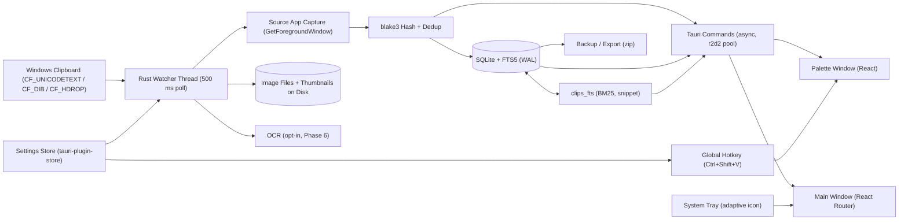
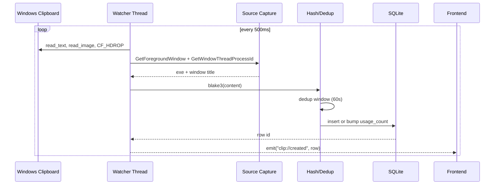
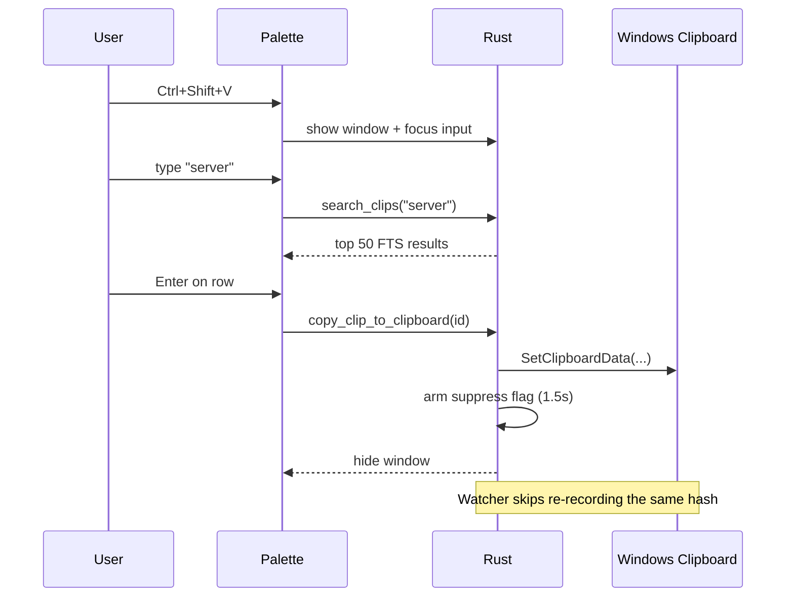

# ClipVault Architecture

This document explains the moving parts of ClipVault and how they fit together.

## Data flow



## Database schema

```mermaid
erDiagram
  clips ||--o| images : "1:0..1"
  clips ||--o| file_clips : "1:0..1"
  clips }o--o| collections : "n:0..1"
  clips ||--o{ tags : "1:n"
  clips_fts ||--|| clips : "FTS mirror"
  snippets_fts ||--|| snippets : "FTS mirror"

  clips {
    TEXT id PK
    TEXT type
    TEXT content_hash
    TEXT text_preview
    INTEGER byte_size
    TEXT source_app
    TEXT source_title
    INTEGER is_favorite
    INTEGER is_pinned
    TEXT collection_id FK
    INTEGER created_at
    INTEGER usage_count
  }
  collections { TEXT id PK; TEXT name UK; TEXT icon; INTEGER created_at }
  tags { TEXT clip_id FK; TEXT tag }
  images { TEXT clip_id PK FK; TEXT path; INTEGER width; INTEGER height; TEXT thumb_path; TEXT mime }
  file_clips { TEXT clip_id PK FK; TEXT paths }
  snippets { TEXT id PK; TEXT title; TEXT language; TEXT body; INTEGER is_favorite; INTEGER created_at; INTEGER updated_at }
  settings { TEXT key PK; TEXT value }
```

## Clipboard capture lifecycle



## Quick Paste flow



## Performance budget

| Metric               | Target          | Where it's enforced                                      |
| -------------------- | --------------- | -------------------------------------------------------- |
| Cold start           | < 1 s           | `tauri-plugin-single-instance`, deferred DB open         |
| Idle RAM             | < 100 MB        | `r2d2` pool (8 conns), virtualized lists, no in-mem cache |
| Search p95           | < 50 ms         | FTS5 + BM25, keyset pagination, prepared statements      |
| Watcher poll         | 500 ms          | `clipboard::POLL_INTERVAL`                               |
| Retention sweep      | every 10 min    | `settings::retention::start_sweeper`                     |

## Threading model

| Thread                          | Owner              | Purpose                                                  |
| ------------------------------- | ------------------ | -------------------------------------------------------- |
| Main (Tauri event loop)         | Tauri runtime      | Commands, window events                                  |
| `clipvault-clipboard-watcher`   | Rust               | Polls the clipboard, writes to SQLite                    |
| `clipvault-retention-sweeper`   | Rust               | Periodically prunes old clips + enforces max-clip cap    |
| Tokio runtime (default)         | Rust               | Powers async Tauri commands                              |
| Renderer (main)                 | WebView2           | Timeline / favorites / settings UI                      |
| Renderer (palette)              | WebView2           | Command palette UI                                       |

## Privacy

- `tauri.conf.json` CSP locks down `connect-src`, `script-src`, and `img-src`.
- Capabilities for each window explicitly grant only what is required.
- The `default-src 'self'` directive prevents external resources.
- Network requests require an opt-in feature flag (`sync` or `http_receiver`).

## Build & distribution

| Target     | How                                                | Output                                       |
| ---------- | -------------------------------------------------- | -------------------------------------------- |
| Dev        | `pnpm tauri:dev`                                   | Hot-reloading dev shell                      |
| Release    | `pnpm tauri:build`                                 | `clipvault.exe` + NSIS + MSI bundles         |
| Portable   | `resources/build-portable.cmd`                     | `target/portable/clipvault-portable/`        |
